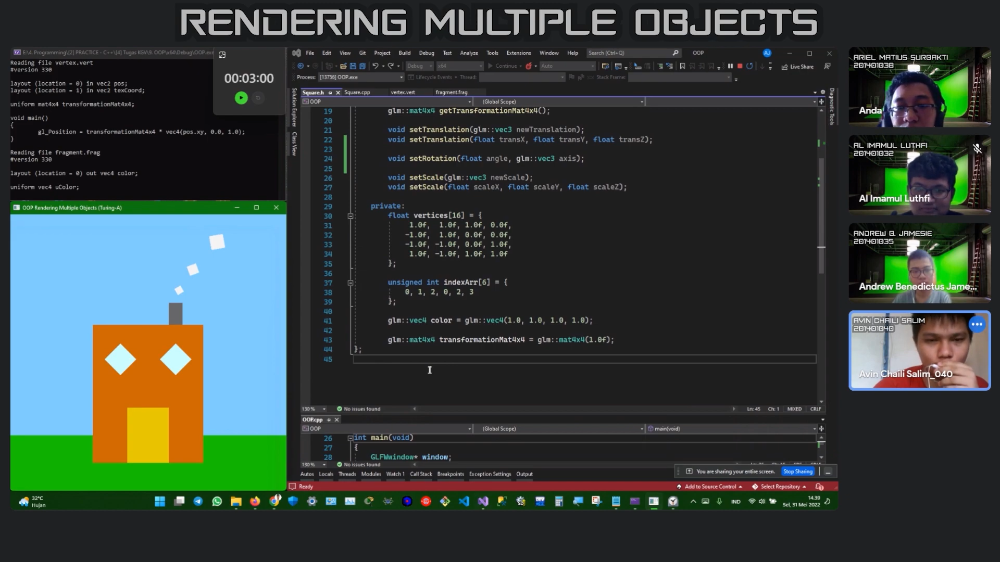
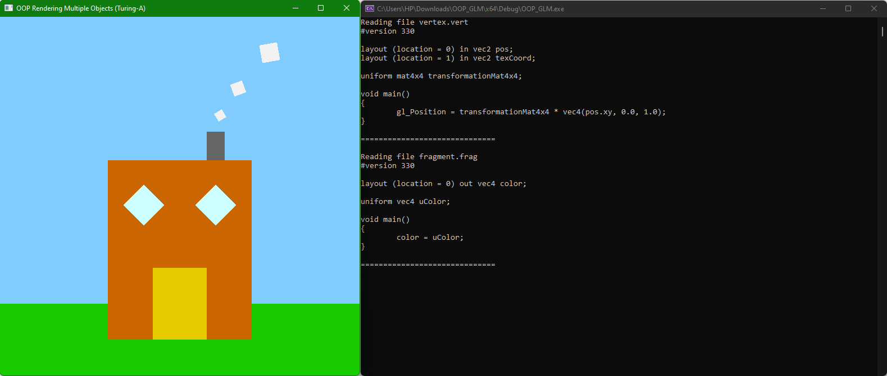

# KGV_Tugas3_Turing-A
#### Ujian Tengah Semester Mata Kuliah Komputer Grafik dan Visualisasi
#### Dosen Pengampu: Jos Timanta Tarigan, S.Kom., M.Sc.
#### Tahun Ajaran: Genap 2021/2022
#### Ilmu Komputer - Universitas Sumatera Utara

# 
**Kelompok Alan Turing Kom A**  
**1. 201401032 - Al Imamul Luthfi**  
**2. 201401035 - Andrew Benedictus Jamesie**  
**3. 201401038 - Ariel Matius Surbakti**  
**4. 201401040 - Avin Chaili Salim**  

**YouTube Video**  

# 
# Tugas 3 KGV Kelompok Turing-A
**OOP_GLM**
> - Project ini berupa program visual untuk menampilkan gambaran rumah bertingkat dengan cerobong asap yang dibentuk dari beberapa objek persegi. Objek persegi tersebut ditranslasi atau perpindahan, dirotasi, dan diskalasi atau dilatasi sehingga membentuk sebuah rumah.
> - Folder ini merupakan project/solution **Console Application** Visual Studio, sehingga bisa di-_compile_ dan dijalankan dengan menggunakan Microsoft Visual Studio.
> - Dalam folder ini terdapat file Program `.sln` yang dapat dibuka dengan menggunakan Visual Studio.
> - Sedangkan jika hanya ingin melihat _source code_-nya akan dijelaskan di bawah.
> 
> **Rendering Multiple Objects**  
> 

# 
# Note:
#### Dalam folder ini terdapat 4 file yang penting, yaitu:
- **OOP_GLM.cpp**  
  Ini adalah _file_ utama dari project/solution ini. Dalam _file_ ini dilakukan pembuatan _window_ untuk menampilkan gambar objek persegi, perintah untuk melakukan translasi, rotasi, dan dilatasi, perintah untuk melakukan penggambaran dan pewarnaan dengan `vertices vertexBuffer` dan `indexArr indexBuffer`, serta melakukan _link_ dan _bind_ dengan _file_ `vertex.vert` dan `fragment.frag` untuk melakukan _render shader_.
- **Square.h**  
  Ini adalah _header file_ untuk _class_ Square. Dalam _class_ ini, terdapat _public_ dan _private_ _class access specifier_. Terdapat pendeklarasian _constructor_, _method_, dan _attribute_ atau variabel yang akan digunakan.
- **Square.cpp**  
  Ini adalah _cpp file_ untuk _class_ Square. Dalam _file_ ini hanya terdapat isi dari constructor, serta _setter_ and _getter method_ yang telah dideklarasikan terlebih dahulu di file `Square.h`.
- **Util.h**  
  Ini adalah _file_ untuk menghubungkan _file_ utama `OOP_GLM.cpp` dengan _file_ vertex dan fragment, yaitu `vertex.vert` dan `fragment.frag`. _File_ ini juga berfungsi untuk melakukan _debugging_ yang akan ditampilkan pada console/terminal pada saat menjalankan (_run_) program.
- **vertex.vert**  
  Ini adalah _file_ untuk menentukan penggambaran posisi dari `vertices` dan `indexBuffer` yang akan dihubungkan dengan variabel uniform `transformationMat4x4` untuk melakukan pengubahan gambar bangun datar. baik translasi, rotasi, dan dilatasi. Pointer location 0 digunakan untuk pointer data posisi _vertices_, sedangkan pointer location 2 untuk menentukan _texture_ objek.
- **fragment.frag**  
  Ini adalah _file_ untuk menentukan pewarnaan fragment color, yaitu `uColor` yang diambil dari `color` untuk menghasilkan warna yang telah diatur dalam _method setter_.
